

# User Interface

[Wireframe History](#wireframe-history)

### [BrewHop](https://brewhoppers.gitlab.io/brew-hop) includes these graphical human interfaces or GHIs.

Landing Page:
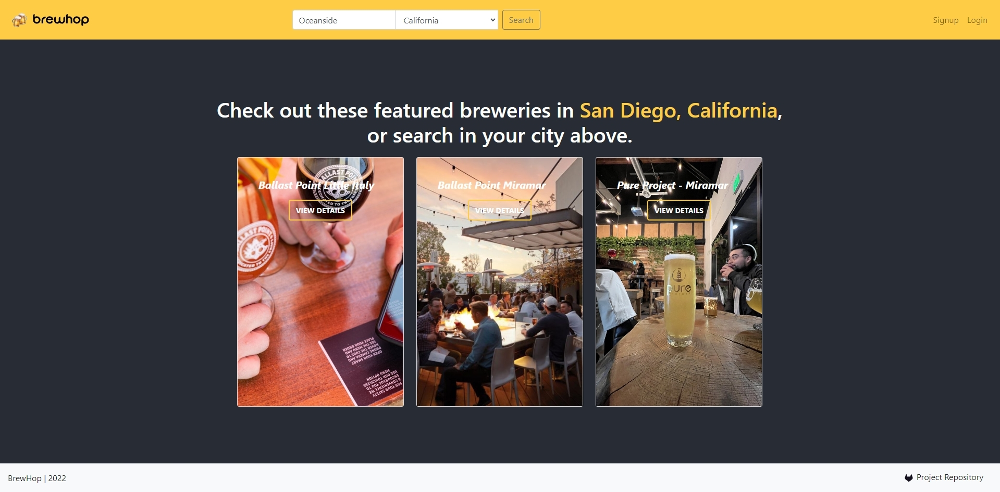

Sign-up form:
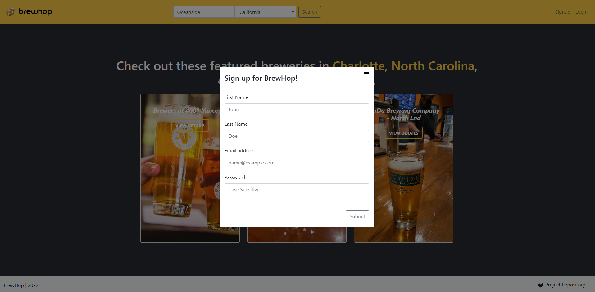

Login form:
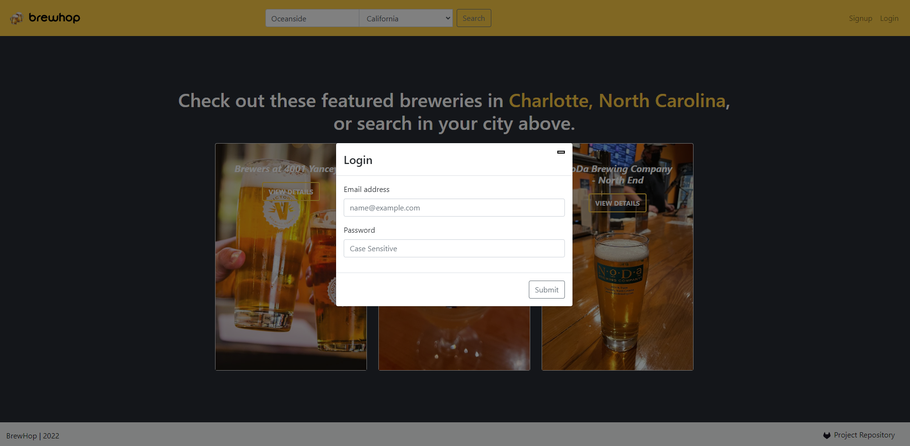

Details page:
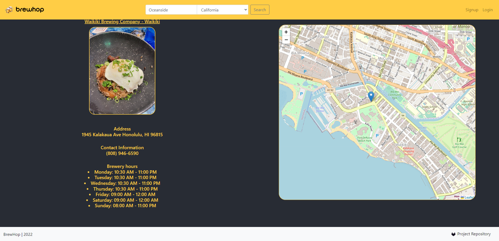

Search results:
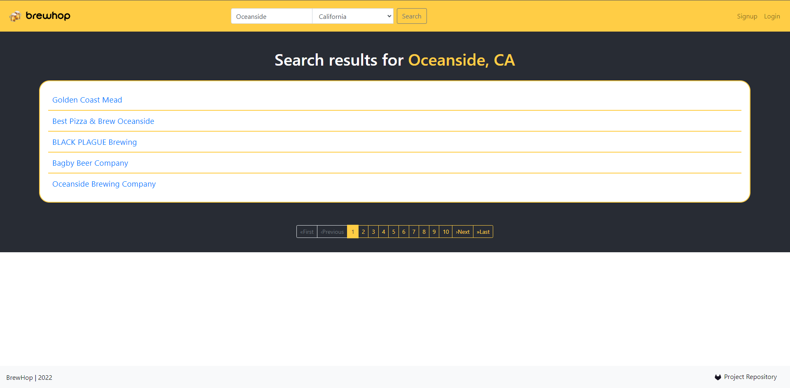

User favorites:
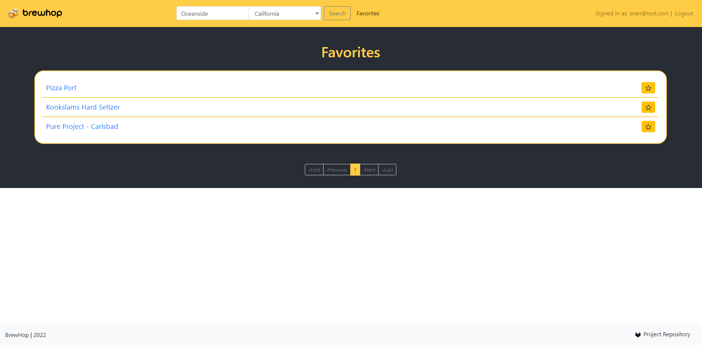

Invalid url page:
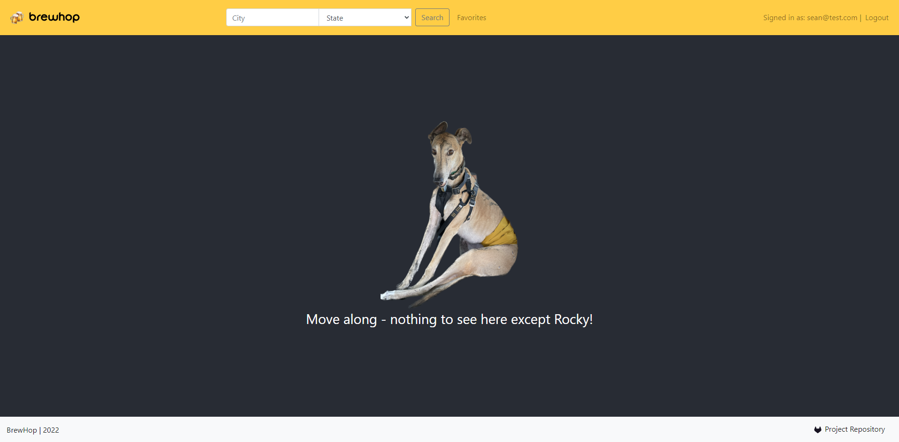

## Wireframe History

History

### Home Page
This will be the home page of the website which will include three breweries from a featured major city.
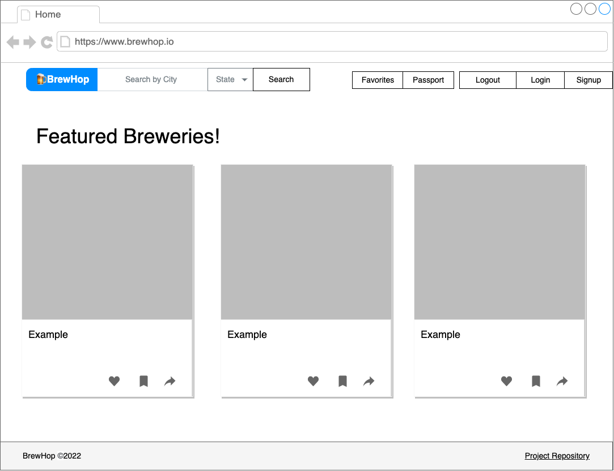

### Brewery Search
This will display the results list of breweries in the city & state input from the search in the navigation bar. Users can click the linked name of entries to navigate to a detail page. Logged in users will be able to add/remove list entries to their favorites by clicking the star.
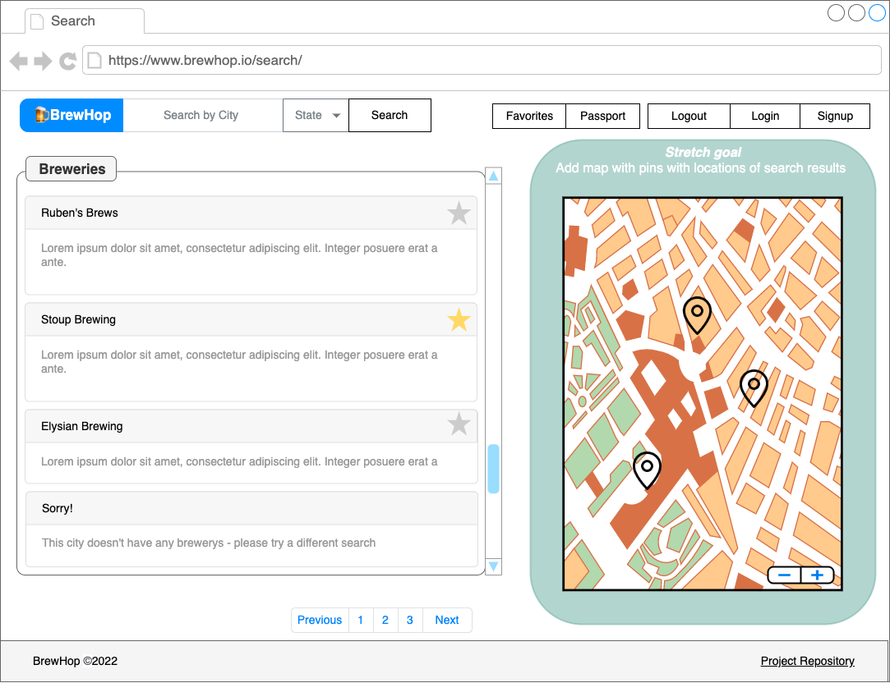

### Brewery Detail
This will display the details of one unique selected brewery including general information about the brewery. Logged in users will be able to add/remove favorite from this page as well.
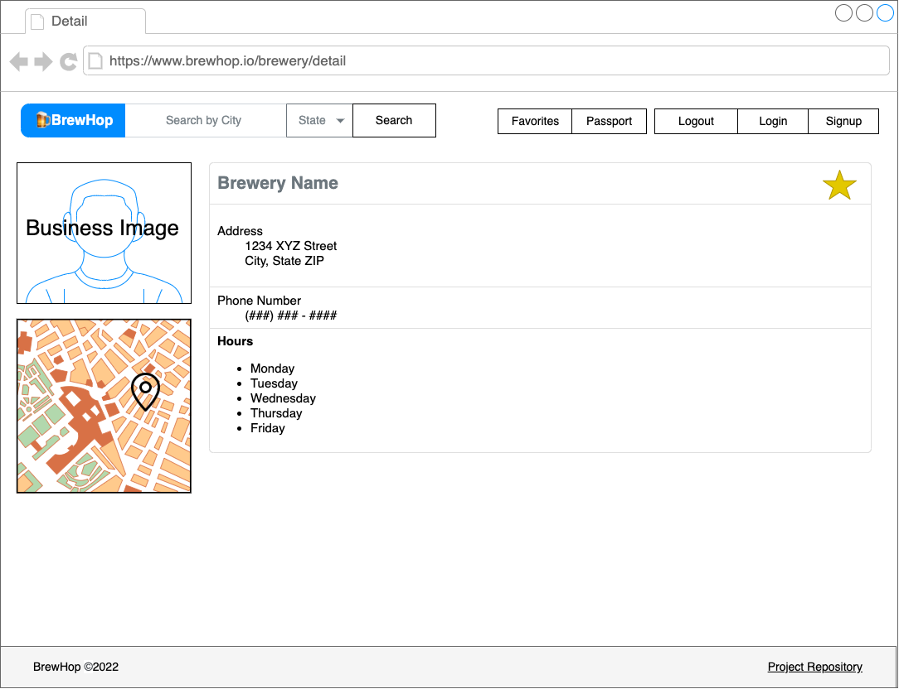

### User Favorites
This will display a list of the user's favorites for logged in users. User will be able to remove favorites from this page as well.
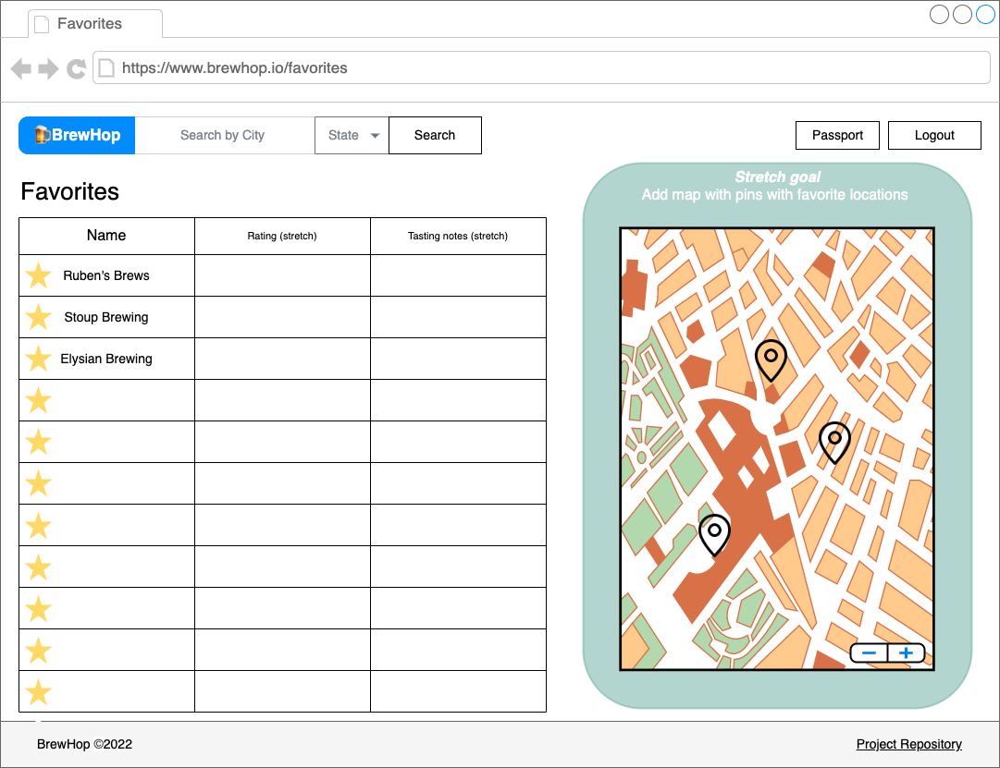

### User Login & Sign Up
Modal forms where the user will be able to login or sign up for an account for users that are not logged in.
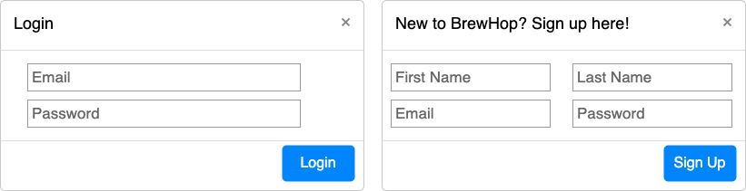

### Invalid URL
This page will display for invalid URLs.
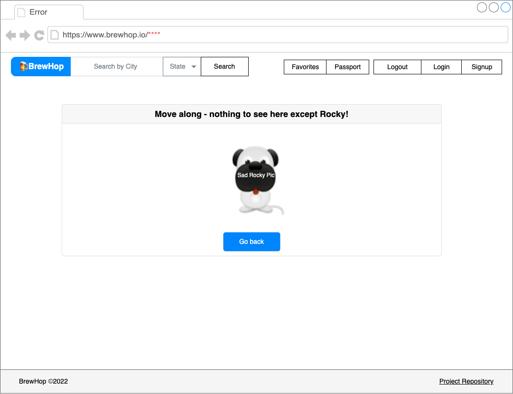

### ***FOR REFERENCE*** User Flow & Design Notes
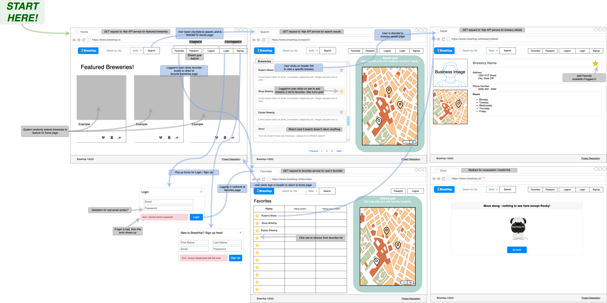

[Back to top](#user-interface)

